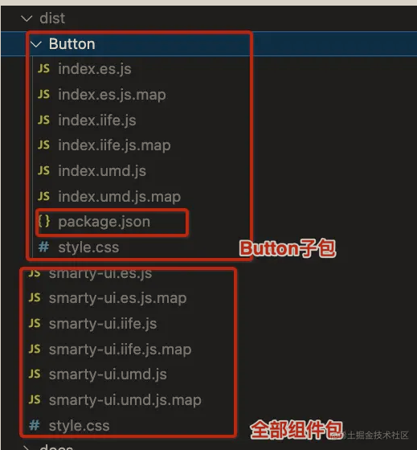

### pnpm搭建Monorepo

1. 修改软件包目录

   ```bash
    ├── packages
    |   ├── quick-ui-vite  # UI组件库
    |   |   ├── package.json
    |   ├── docs-ui # docs文档
    |   |   ├── package.json
    ├── package.json
   ```

   添加packages目录，移动组件库所有文件到quick-ui-vite下
2. 初始化monorepo包

   ```bash
   pnpm init
   ```

   项目中应禁止使用yarn和npm，否则会有兼容问题，使用`preinstall npm hook`钩子，在安装模块前触发，检查代码是否使用pnpm运行，如果不是的话会报错并退出

   ```json
   "scripts": {
     "preinstall": "node ./scripts/preinstall.js"
   }
   ```

   ```js
   // preinstall.js
   if (!/pnpm/.test(process.env.npm_execpath || '')) {
    console.warn(
      `\u001b[33mThis repository requires using pnpm as the package manager` +
        `for scripts to work properly.\u001b[39m\n`
    )
    process.exit(1)
   }

   ```

   或者可以考虑使用

   ```json
   "scripts": {
      "preinstall": "npx only-allow pnpm"
    }
   ```

3. 初始化工作空间
   创建pnpm-workspace.yaml，用于声明所有软件包全部存放在packages目录中
4. 创建新的项目
   - 初始化项目

     ```bash
     mkdir docs-vite
     cd docs-vite
     pnpm init
     ```

   - 安装vite
     如果多个项目同时依赖一个包，需要将依赖安装到workspace中，这样每个包都无需在单独安装，例如vite

     ```bash
     # 安装vite到workspace中 -w表示全局安装 当前项目全局
     pnpm i vite -w
     ```
  
   - 安装vue

     ```bash
     # 如果只安装在子package中，可以使用-r
     # 子package安装
     pnpm i vue -r --filter quick-ui-vite
     # 或者 直接在docs-vite目录下
     pnpm i vue
     ```

   - 将quick-ui-vite安装到docs-vite中

     ```bash  
     # 内部依赖package安装
     pnpm i quick-ui-vite -r --filter docs-vite
     ```

   - 安装后，docs-vite中quick-ui-vite位置会指向workspace，这就是monorepo的精髓所在

     ```json
     ...
     "quick-ui-vite": "workspace:^1.0.0",
     ...
     ```

   - 编辑index.html测试
   - 在scripts中添加dev脚本，pnpm dev启动测试

### 实现组件库的按需引入

两种方法：

1. 经典方法：组件单独分包 + 按需导入 + babel-plugin-component(自动化按需引入)
2. 次时代方法：ESModule + TreeShaking + 自动按需import(unplugin-vue-components自动化配置)

#### 分包与摇树（TreeShaking)

TreeShaking通过语法分析去除无用代码，Roolup、Vite合新版本webpack都支持，例如组件库之引入了Button

```js
import { Button } from 'quick-ui-vite';
```

编辑器会自动将其他组件代码去掉

#### 实现分包导出

分包导出相当于将组件库形成无数个子软件包，并满足以下要求：

1. 文件名即组件名
2. 独立的package.json定义，包含esm和umd的入口定义
3. 每个组件必须以Vue插件形式进行加载
4. 每个软件包必须有单独的css导出
  


#### 代码重构

1. 复制一份原有的button文件夹进行修改
2. 修改index.ts，默认导出vue插件

   ```ts
    import Button from "./Button";
    import { App } from "vue";
    // 导出Button组件
    export { Button };
    // 导出Vue插件
    export default {
      install(app: App) {
        app.component(Button.name, Button);
      },
    };

   ```

3. 编写分包导出脚本 scripts/build.ts
   默认导出方式通过vite.config.js的build属性配置，分包时需要为每个组件配置自己的配置文件，自动读取文件夹遍历打包，并复制package.json文件
  
   1. 导入vite.config中的配置，使用vite的build方法进行全量打包
   2. 读取文件夹 遍历组件库文件夹
   3. 为每个模块定制不同的编译规则，编译规则如下
      - 导出文件夹为 dist/ <组件名>/ 例： dist/Button；
      - 导出模块名为： index.es.js、index.umd.js；
      - 导出模块名为： <组件名> iffe 中绑定到全局的名字。
   4. 为子模块定制自己的package.json文件，npm规定，当import子组件包时会根据子包中的package.json文件找到对应的模块
   5. 在scripts中添加命令
      node不能直接执行ts文件，需要安装ts-node这个库，esno 是基于 esbuild 的 TS/ESNext node 运行时，和ts-node的区别就是使用esbuild作编译器，快

      ```json
      "scripts": {
        ...
        "build:components": "esno ./scripts/build.ts",
        ...
      }
      ```

   6. 测试按需加载，创建demo/button/index.html测试
4.
